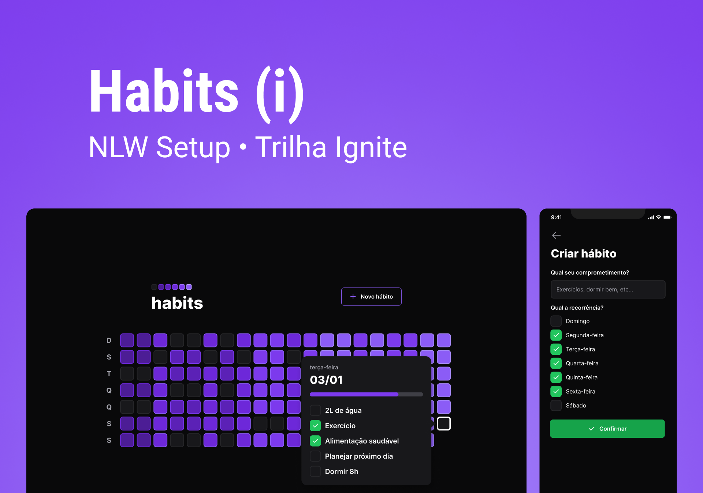

<h1 align="center">Habits</h1>

Habits é um marcador de hábitos diários  

 

  

## 🚀 Tecnologias

Esse projeto foi desenvolvido com as seguintes tecnologias:

- Typescript
- React 
- Radix
- Tailwind CSS
- Node 
- Prisma
- SQLite
- Git e Github
- Vite

## 💻 Projeto

Habits é um App de uso diário, tendo como intuido um marcador diário de hábitos
feitos no dia! sendo ele para ajudar os usuários a conseguirem organizar o dia, semana 
, mês...

